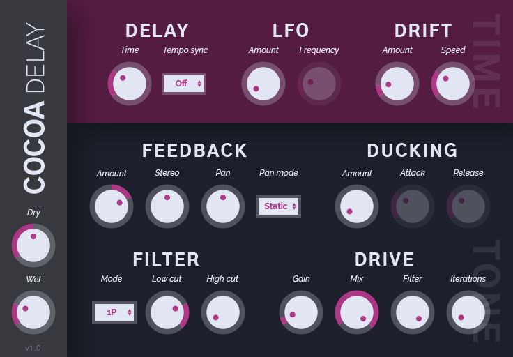

# Cocoa Delay

**Cocoa Delay** is a free, open-source delay plugin in VST format. It focuses on clean design, easy operation, and a warm, lively sound.

Notable features:
- Delay time drift, for giving the wet signal a slight wow/flutter effect
- Adjustable wet level ducking based on the input signal
- Static, ping-pong, and circular pan modes
- Drive section based on open-source Airwindows saturation code

## Contributing

Feel free to give feedback on design, report bugs, make pull requests, etc. I like all sorts of involvement!

### Building Cocoa Delay

1. Clone [wdl-ol](https://github.com/olilarkin/wdl-ol).
2. Add the necessary include files for the build targets you want to use. See [Martin Finke's tutorial](http://www.martin-finke.de/blog/articles/audio-plugins-002-setting-up-wdl-ol/) for more information.
3. Clone the cocoa-delay repo into the wdl-ol base directory.
4. Open CocoaDelay.sln in Visual Studio and build the project for the desired target.
